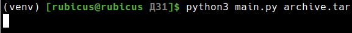
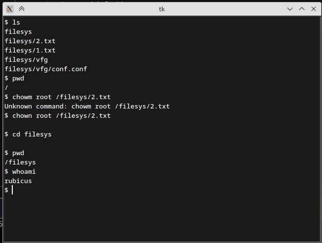
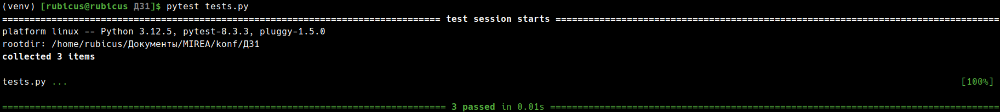

# Вариант № 19
## Задание №1
### Условие
Разработать эмулятор для языка оболочки ОС. Необходимо сделать работу
эмулятора как можно более похожей на сеанс shell в UNIX-подобной ОС.
Эмулятор должен запускаться из реальной командной строки, а файл с
виртуальной файловой системой не нужно распаковывать у пользователя.
Эмулятор принимает образ виртуальной файловой системы в виде файла формата
tar. Эмулятор должен работать в режиме GUI.
Ключами командной строки задаются:
• Путь к архиву виртуальной файловой системы.
Необходимо поддержать в эмуляторе команды ls, cd и exit, а также
следующие команды:
1. whoami.
2. chown.

Все функции эмулятора должны быть покрыты тестами, а для каждой из
поддерживаемых команд необходимо написать 3 теста.

### Решение

Был разработан эмулятор терминала на python, поддерживающий необходимые команды.
Команды были покрыты тестами, которые были успешно пройдены.

Запуск программы с аргументом архива файловой системы

Работа эмулятора

### Тестирование

Успешное выполнение тестов
