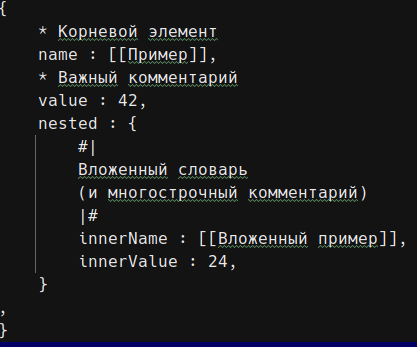

# Вариант № 19
## Задание №3
### Условие
Разработать инструмент командной строки для учебного конфигурационного
языка, синтаксис которого приведен далее. Этот инструмент преобразует текст из входного формата в выходной. Синтаксические ошибки выявляются с выдачей сообщений.
Входной текст на языке xml принимается из файла, путь к которому задан ключом командной строки. Выходной текст на учебном конфигурационном языке попадает в файл, путь к которому задан ключом командной строки.

Однострочные комментарии:
* Это однострочный комментарий

Многострочные комментарии:
#|
Это многострочный
комментарий
|#

Словари:
{
имя : значение,
имя : значение,
имя : значение,
...
}

Имена: [_a-zA-Z][_a-zA-Z0-9]*

Значения: Числа, Строки, Словари.
Строки: [[Это строка]]

Объявление константы на этапе трансляции: значение -> имя

Вычисление константы на этапе трансляции: .(имя).

Результатом вычисления константного выражения является значение.

### Тестирование

Программа успешно прошла тестирование.

Исходный файл

Результат

