# Практическое занятие №2. Менеджеры пакетов

П.Н. Советов, РТУ МИРЭА

Разобраться, что представляет собой менеджер пакетов, как устроен пакет, как читать версии стандарта semver. Привести примеры программ, в которых имеется встроенный пакетный менеджер.

## Задача 1

Вывести служебную информацию о пакете matplotlib (Python). Разобрать основные элементы содержимого файла со служебной информацией из пакета. Как получить пакет без менеджера пакетов, прямо из репозитория?

`pip show matplotlib`

```
(venv) [rubicus@rubicus ДЗ1]$ pip show matplotlib
Name: matplotlib
Version: 3.9.2
Summary: Python plotting package
Home-page:
Author: John D. Hunter, Michael Droettboom
Author-email: Unknown <matplotlib-users@python.org>
License: License agreement for matplotlib versions 1.3.0 and later
```

Ubuntu
`sudo apt install python3-matplotlib`

Arch
`sudo pacman -S python-matplotlib`


## Задача 2

Вывести служебную информацию о пакете express (JavaScript). Разобрать основные элементы содержимого файла со служебной информацией из пакета. Как получить пакет без менеджера пакетов, прямо из репозитория?

`npm view express`

```
[rubicus@rubicus ~]$ npm view express

express@4.21.0 | MIT | deps: 31 | versions: 279
Fast, unopinionated, minimalist web framework
http://expressjs.com/

keywords: express, framework, sinatra, web, http, rest, restful, router, app, api

dist
.tarball: https://registry.npmjs.org/express/-/express-4.21.0.tgz
.shasum: d57cb706d49623d4ac27833f1cbc466b668eb915
.integrity: sha512-VqcNGcj/Id5ZT1LZ/cfihi3ttTn+NJmkli2eZADigjq29qTlWi/hAQ43t/VLPq8+UX06FCEx3ByOYet6ZFblng==
.unpackedSize: 220.8 kB

dependencies:
accepts: ~1.3.8            content-type: ~1.0.4       depd: 2.0.0                finalhandler: 1.3.1        methods: ~1.1.2            proxy-addr: ~2.0.7
array-flatten: 1.1.1       cookie-signature: 1.0.6    encodeurl: ~2.0.0          fresh: 0.5.2               on-finished: 2.4.1         qs: 6.13.0
body-parser: 1.20.3        cookie: 0.6.0              escape-html: ~1.0.3        http-errors: 2.0.0         parseurl: ~1.3.3           range-parser: ~1.2.1
content-disposition: 0.5.4 debug: 2.6.9               etag: ~1.8.1               merge-descriptors: 1.0.3   path-to-regexp: 0.1.10     safe-buffer: 5.2.1
(...and 7 more.)

maintainers:
- wesleytodd <wes@wesleytodd.com>
- dougwilson <doug@somethingdoug.com>
- linusu <linus@folkdatorn.se>
- sheplu <jean.burellier@gmail.com>
- blakeembrey <hello@blakeembrey.com>
- ulisesgascon <ulisesgascondev@gmail.com>
- mikeal <mikeal.rogers@gmail.com>

dist-tags:
latest: 4.21.0  next: 5.0.0

published a week ago by wesleytodd <wes@wesleytodd.com>
```

Ubuntu
`sudo apt install node-express`

Arch
`sudo pacman -S nodejs-express`

## Задача 3

Сформировать graphviz-код и получить изображения зависимостей matplotlib и express.

```graphviz
digraph G {
    matplotlib -> contourpy;
    matplotlib -> cycler;
    matplotlib -> fonttools;
    matplotlib -> kiwisolver;
    matplotlib -> numpy;
    matplotlib -> packaging;
    matplotlib -> pillow;
    matplotlib -> pyparsing;
    matplotlib -> "pytohn-dateutil";

    express -> accepts;
    express -> cookie;
    express -> debug;
    express -> depd;
    express -> encodeurl;
    express -> etag;
    express -> finalhandler;
    express -> fresh;
    express -> methods;
    express -> qs;
    express ->  send;
    express -> setprototypeof;
    express -> statuses;
    express ->  vary;

}
```




## Задача 4

**Следующие задачи можно решать с помощью инструментов на выбор:**

* Решатель задачи удовлетворения ограничениям (MiniZinc).
* SAT-решатель (MiniSAT).
* SMT-решатель (Z3).

Изучить основы программирования в ограничениях. Установить MiniZinc, разобраться с основами его синтаксиса и работы в IDE.

Решить на MiniZinc задачу о счастливых билетах. Добавить ограничение на то, что все цифры билета должны быть различными (подсказка: используйте all_different). Найти минимальное решение для суммы 3 цифр.

```
include "globals.mzn";

array[1..6] of var 0..9: digits;

constraint all_different(digits);
constraint sum(digits[1..3]) = sum(digits[4..6]);

solve minimize sum(digits[1..3]) = sum(digits[4..6]);

output [
  "Счастливый билет: " ++ show(digits) ++ "\n"
];
```

## Задача 5

Решить на MiniZinc задачу о зависимостях пакетов для рисунка, приведенного ниже.


```minizinc
var int: menuver;
var int: dropdownver;
var int: iconsver;

constraint (
    menuver >= 100 /\
    menuver <= 150 /\
    dropdownver >= 180 /\
    dropdownver <= 230 /\
    iconsver >= 100 /\
    iconsver <= 200 
);

solve minimize menuver + dropdownver + iconsver;
output ["\(menuver) \(dropdownver) \(iconsver)"];
```

## Задача 6

Решить на MiniZinc задачу о зависимостях пакетов для следующих данных:

```
root 1.0.0 зависит от foo ^1.0.0 и target ^2.0.0.
foo 1.1.0 зависит от left ^1.0.0 и right ^1.0.0.
foo 1.0.0 не имеет зависимостей.
left 1.0.0 зависит от shared >=1.0.0.
right 1.0.0 зависит от shared <2.0.0.
shared 2.0.0 не имеет зависимостей.
shared 1.0.0 зависит от target ^1.0.0.
target 2.0.0 и 1.0.0 не имеют зависимостей.
```


```minizinc
var 100..100: root;
var 100..200: foo;
var 100..200: left;
var 100..200: right;
var 100..200: shared;
var 100..200: target;

% root 1.0.0 зависит от foo ^1.0.0 и target ^2.0.0.
constraint root = 100 -> (foo >= 100 /\ target >= 200);

% foo 1.1.0 зависит от left ^1.0.0 и right ^1.0.0.
constraint foo = 110 -> (left >= 100 /\ right >= 100);

% foo 1.0.0 не имеет зависимостей.
constraint foo = 100 -> true;

% left 1.0.0 зависит от shared >=1.0.0.
constraint left = 100 -> (shared >= 100);

% right 1.0.0 зависит от shared <2.0.0.
constraint right = 100 -> (shared < 200);

% shared 2.0.0 не имеет зависимостей.
constraint shared = 200 -> true;

% shared 1.0.0 зависит от target ^1.0.0.
constraint shared = 100 -> (target >= 100);

% target 2.0.0 и 1.0.0 не имеют зависимостей.
constraint target = 100 -> true;
constraint target = 200 -> true;

solve satisfy;
output [
  "root version: ", show(root), "\n",
  "foo version: ", show(foo), "\n",
  "left version: ", show(left), "\n",
  "right version: ", show(right), "\n",
  "shared version: ", show(shared), "\n",
  "target version: ", show(target), "\n"
];
```


## Задача 7

Представить задачу о зависимостях пакетов в общей форме. Здесь необходимо действовать аналогично реальному менеджеру пакетов. То есть получить описание пакета, а также его зависимости в виде структуры данных. Например, в виде словаря. В предыдущих задачах зависимости были явно заданы в системе ограничений. Теперь же систему ограничений надо построить автоматически, по метаданным.

## Полезные ссылки

Semver: https://devhints.io/semver

Удовлетворение ограничений и программирование в ограничениях: http://intsys.msu.ru/magazine/archive/v15(1-4)/shcherbina-053-170.pdf

Скачать MiniZinc: https://www.minizinc.org/software.html

Документация на MiniZinc: https://www.minizinc.org/doc-2.5.5/en/part_2_tutorial.html

Задача о счастливых билетах: https://ru.wikipedia.org/wiki/%D0%A1%D1%87%D0%B0%D1%81%D1%82%D0%BB%D0%B8%D0%B2%D1%8B%D0%B9_%D0%B1%D0%B8%D0%BB%D0%B5%D1%82
